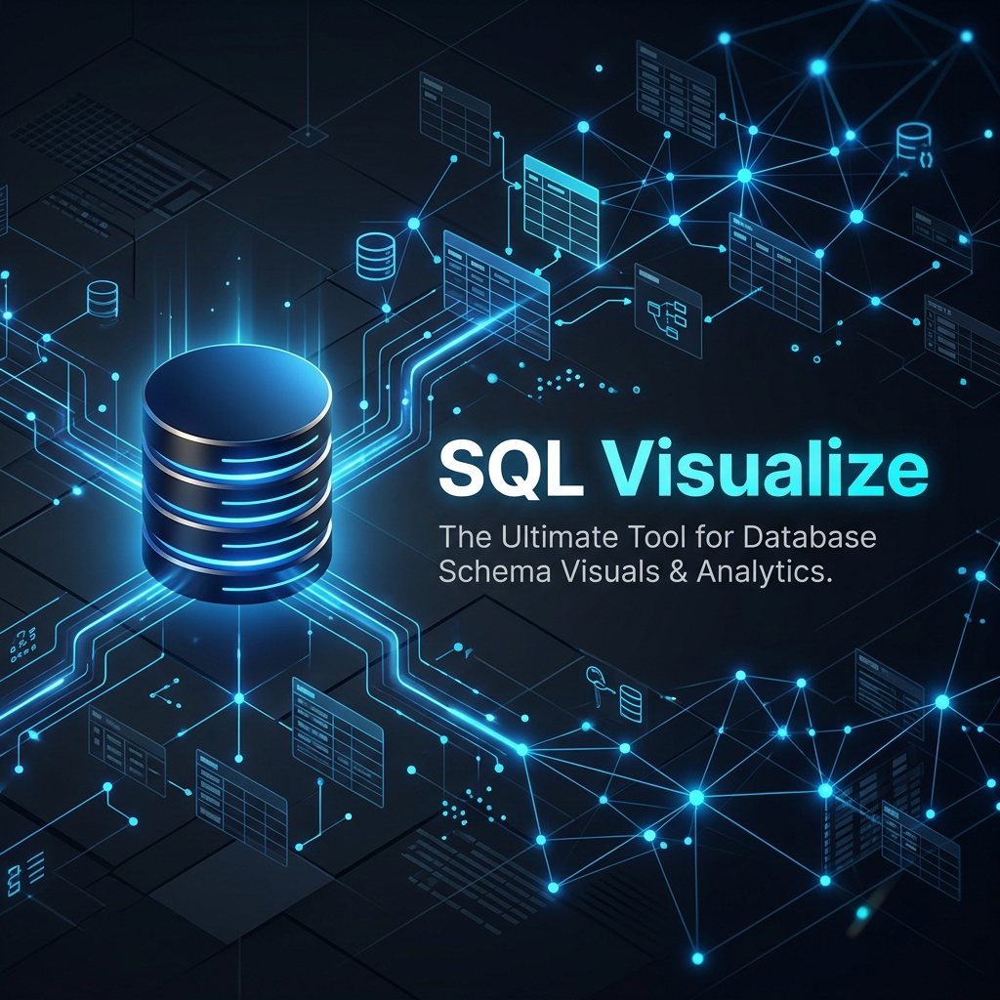

# 🛰️ SQL Visualize
### *The Intelligent Visual T-SQL Designer for VS Code*



**SQL Visualize** eliminates the complexity of manual T-SQL query construction. By combining a high-performance interactive canvas with an intelligent relational engine, it allows developers to build production-ready queries with zero syntax errors.

---

## ✨ Key Features

### 🌲 Premium Object Explorer
Skip the flat lists. Our explorer groups objects by **Schema**, supports **Auto-Expand** during search, and allows you to **Peek at Columns** and types directly in the sidebar. Used a "Ghost Eye" icon for instant `TOP 25` data previews.

### 🧠 Intelligent Join Suggester
Building relationships is now effortless. As you drag tables like `Orders` onto the canvas, SQL Visualize scans for Foreign Keys and overlays **"Ghost Joins"** (dashed lines). Accept them with one click to instantly integrate them into your query.

### 🎨 Visual Join Editor
Configure complex relationships using our **Venn Diagram** pop-over. Visualize `INNER`, `LEFT`, `RIGHT`, and `FULL` joins with real-time hover feedback, ensuring you always get the right set of data.

### 📊 Batch Execution Engine
Got a complex canvas with multiple disconnected queries? Our **Island Sensing** technology automatically identifies separate table clusters and generates them as distinct, valid T-SQL batches.

### 🛠️ Robust SQL Compiler
Our engine handles the "heavy lifting"—automatically injecting `GROUP BY` clauses, resolving column name collisions across tables, and managing circular join paths (A-B-C-A).

---

## 🛠️ Tech Stack

- **Core**: VS Code Extension API (TypeScript)
- **Frontend**: React + React Flow + SVG Components
- **Styling**: VS Code Webview UI Toolkit (Seamless Integration)
- **Testing**: 56-Case Automated Regression Suite (Mocha/Chai)

---

## 🚀 Getting Started

### Installation
1. Search for **SQL Visualize** in the VS Code Extension Marketplace.

### Usage
1. Open the Command Palette (**Ctrl+Shift+P**).
2. Type `SQL Visualize: Open Canvas`.
3. Follow the [SQL Server Setup Guide](./docs/sql-server-setup.md) to enable TCP/IP and SQL Authentication.
4. Provide your connection string and click **Connect Engine**.
5. Drag tables from the hierarchical explorer to the canvas and start designing!

> [!TIP]
> Use the **Target Node** feature (Right-click a node) to isolate and run only the sub-query connected to that specific table.

---

## 🔧 Developer Setup

If you want to contribute to the engine or build your own node types:

```bash
# Clone and install
git clone https://github.com/your-username/sql-visualize.git
npm install

# Build all components
npm run compile

# Test the core logic
npm run test:unit
```

---

## 📄 References
- [Full Feature Documentation](./docs/features.md)
- [Architecture & Workflow](./docs/architecture.md)
- [SQLViz Workspace Format](./docs/sqlviz-format.md)

---

## 📄 License
MIT License. Created by Naveen.
